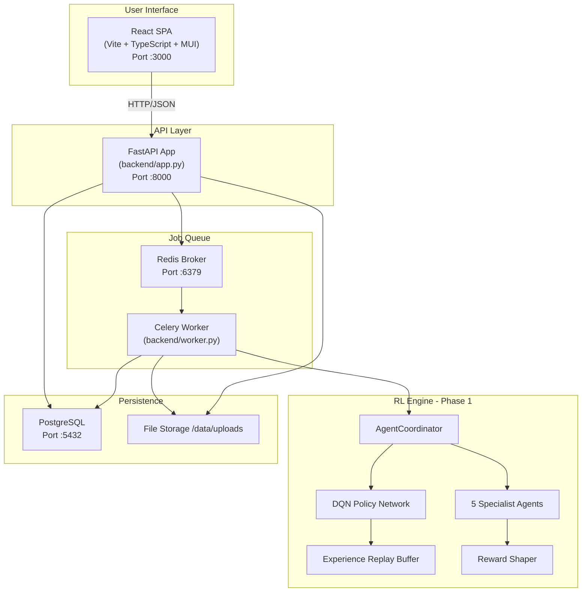
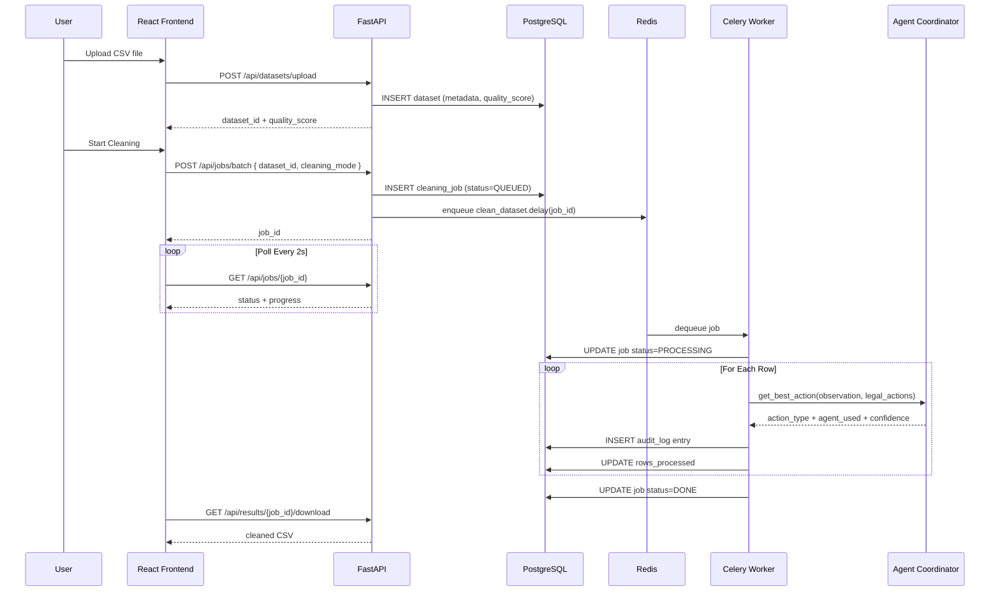
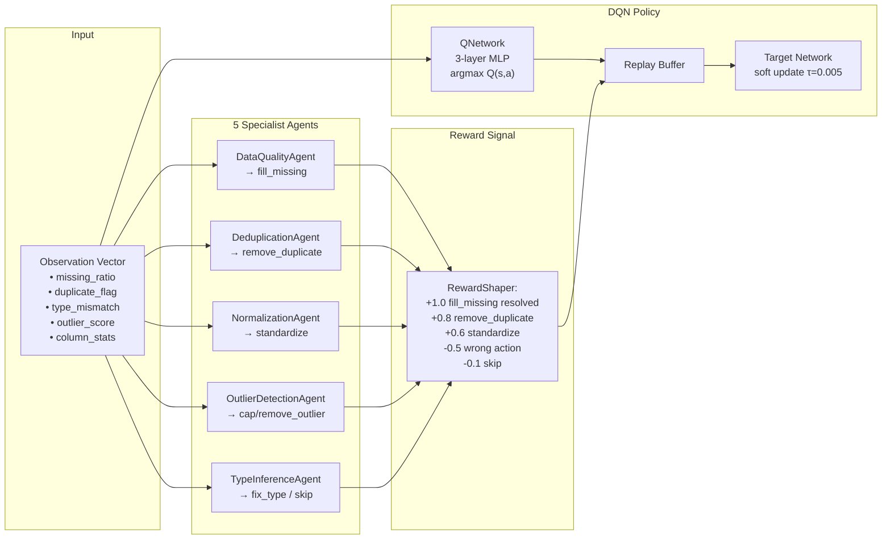
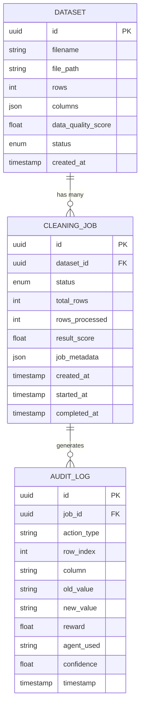
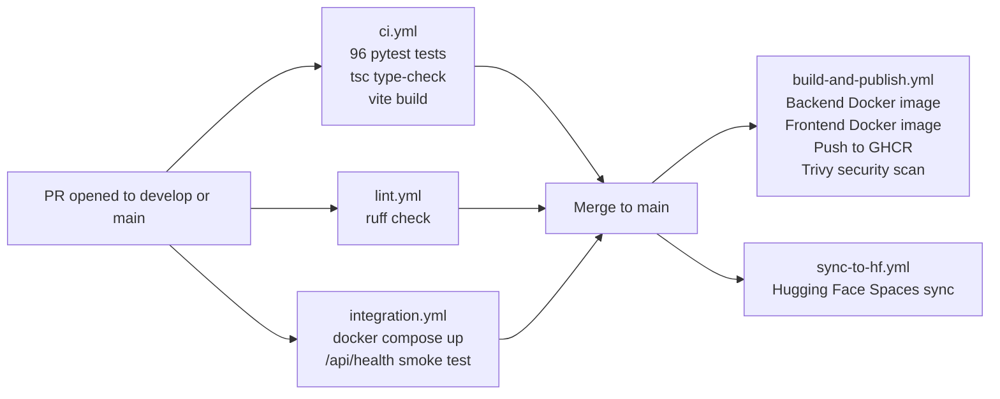

# data-cleaning-openenv — Project Overview & Architecture Diagrams

> **Quick navigation for any AI tool or new contributor:** This is the entry point. Read this document first to understand the system as a whole before touching any code. Every other document in `docs/` is linked from here.

**Repository:** https://github.com/AnubhavKiroula/data-cleaning-openenv  
**Last updated:** August 2026  
**Overall Phase Status:**

| Phase | Name | Status |
|---|---|---|
| **Phase 1** | Multi-Agent RL Engine | ✅ 100% Complete |
| **Phase 2** | FastAPI Backend & Job Queue | 🟡 85% Complete |
| **Phase 3** | React + TypeScript UI | 🟡 80% Complete |
| **Phase 4** | Docker, CI/CD & Deployment | ⚠️ 65% Complete |

---

## 1. What This Project Is

**data-cleaning-openenv** is a production-grade, AI-powered data cleaning platform. Instead of writing one-off cleaning scripts, users upload dirty CSV/Excel datasets and a coordinated ensemble of RL agents autonomously detects and fixes data quality issues — missing values, duplicates, outliers, type mismatches, and normalization problems.

**The core value proposition:**
- A **DQN-based multi-agent system** selects the most effective cleaning action per row, per column, and updates its strategy from feedback (reward shaping).
- A **FastAPI REST backend** exposes the RL engine as an async job queue (Celery + Redis), making it usable by any frontend or API client.
- A **React SPA** provides a polished upload → monitor → export experience.
- **CI/CD via GitHub Actions** builds, tests, and publishes Docker images to GHCR on every merge to `main`.

---

## 2. High-Level System Architecture



---

## 3. Module Map

```
data-cleaning-openenv/
├── backend/
│   ├── app.py                  ← FastAPI app factory, routers, CORS, middleware
│   ├── database.py             ← SQLAlchemy engine, session factory, get_db dependency
│   ├── worker.py               ← Celery app entry point
│   ├── config/
│   │   ├── __init__.py         ← Settings (pydantic-settings, env-driven, no hardcoded values)
│   │   └── celery_config.py    ← Celery broker/backend URL config
│   ├── models/                 ← SQLAlchemy ORM models (one file per domain entity)
│   │   ├── dataset.py          ← Dataset (id, filename, rows, columns, quality_score)
│   │   ├── cleaning_job.py     ← CleaningJob (status FSM: QUEUED → PROCESSING → DONE/FAILED)
│   │   └── audit_log.py        ← Per-action record: agent, action, reward, old/new value
│   ├── routes/                 ← FastAPI routers (no business logic here)
│   │   ├── datasets.py         ← POST /upload, GET /{id}, GET /{id}/metrics
│   │   ├── jobs.py             ← POST /batch, GET /{id}, GET /{id}/audit-log
│   │   └── inference.py        ← POST /inference (direct RL without job queue)
│   ├── services/               ← Business logic (used by routes AND celery tasks)
│   │   └── cleaning_service.py ← Dataset load → agent loop → DB writes → metrics
│   ├── tasks/
│   │   └── cleaning_tasks.py   ← clean_dataset.delay(job_id) Celery task
│   ├── ml/                     ← RL Engine (Phase 1 — fully complete)
│   │   ├── base_agent.py       ← Abstract Agent base class + AgentFactory
│   │   ├── specialist_agents.py← 5 agents: DataQuality, Dedup, Normalize, Outlier, TypeInfer
│   │   ├── agent_coordinator.py← Scores agents, selects best action
│   │   ├── dqn_model.py        ← QNetwork (PyTorch), DQNAgent
│   │   ├── experience_replay.py← Standard + Prioritized Replay Buffers
│   │   ├── reward_shaper.py    ← Configurable reward functions per action type
│   │   ├── train_dqn.py        ← Full training loop with checkpointing
│   │   ├── model_registry.py   ← Save/load trained models with metadata
│   │   └── benchmark.py        ← Agent comparison utilities
│   └── monitoring/
│       ├── metrics.py          ← Prometheus counters/histograms
│       └── middleware.py       ← FastAPI request duration middleware
│
├── frontend/src/
│   ├── pages/                  ← Dashboard, Upload, Results, JobMonitor
│   ├── components/             ← Reusable UI components
│   └── services/api.ts         ← Axios client with typed API methods
│
├── tests/                      ← 96 tests, all passing on main
│   ├── test_agents.py          ← Agent + coordinator unit tests
│   └── test_dqn.py             ← DQN model + replay buffer tests
│
├── .github/workflows/
│   ├── ci.yml                  ← Tests + type-check on every PR
│   ├── build-and-publish.yml   ← Build & push Docker images to GHCR
│   ├── integration.yml         ← Docker Compose smoke tests
│   ├── lint.yml                ← Ruff linter
│   └── sync-to-hf.yml          ← Sync to Hugging Face Spaces on main push
│
├── docker-compose.new.yml      ← Dev compose: postgres + redis + backend + celery + frontend
├── docker-compose.prod.yml     ← Prod compose: uses pre-built GHCR images
└── docs/                       ← All project documentation (you are here)
```

---

## 4. Data Flow: A Cleaning Job End-to-End



---

## 5. RL Engine Architecture (Phase 1 Detail)



---

## 6. Database ER Diagram



---

## 7. CI/CD Pipeline Overview



---

## 8. What's Done vs. What's Left

| Area | Done ✅ | Still Needed ⏳ |
|---|---|---|
| RL Engine | 5 agents, DQN, replay, reward shaping, 96 tests | — |
| Backend API | Upload, jobs CRUD, audit-log, health, metrics | Rate limiting, pagination, result download endpoint |
| Auth | JWT_SECRET in config | JWT middleware, login endpoint, protected routes |
| Celery | Task enqueue + execute + audit log | Error retry policy, dead-letter queue |
| Frontend | 4 pages, API client, TypeScript strict mode | Real-time updates (SSE/WS), auth login page |
| Docker | Multi-stage Dockerfiles, dev + prod compose | — |
| CI/CD | Tests, lint, Docker build, sync-to-hf | Fix CI failures in 3 copilot PR branches |
| Deployment | Render YAML drafted | Staging env vars, secrets, post-deploy smoke test |

---

## 9. Document Index

| File | Purpose |
|---|---|
| [`00_PROJECT-OVERVIEW-AND-DIAGRAMS.md`](./00_PROJECT-OVERVIEW-AND-DIAGRAMS.md) | **This file** — system architecture, diagrams, module map |
| [`01_PRD.md`](./01_PRD.md) | Product Requirements — *what* and *why* |
| [`02_SRS.md`](./02_SRS.md) | Software Requirements — functional requirements, edge cases |
| [`03_ARCHITECTURE.md`](./03_ARCHITECTURE.md) | Technical architecture — stack, module boundaries, API contracts |
| [`04_UIUX.md`](./04_UIUX.md) | UI/UX — page flows, component map |
| [`05_DEVELOPMENT.md`](./05_DEVELOPMENT.md) | Development guide — SOLID, coding standards, phase roadmap |
| [`06_VERSION-CONTROL.md`](./06_VERSION-CONTROL.md) | Git workflow — branching, commit format, PR template |
| [`DB-SETUP.md`](./DB-SETUP.md) | Local database setup with Docker Compose |
| [`PHASE-2-COMPLETION.md`](./PHASE-2-COMPLETION.md) | Phase 2 implementation plan |
