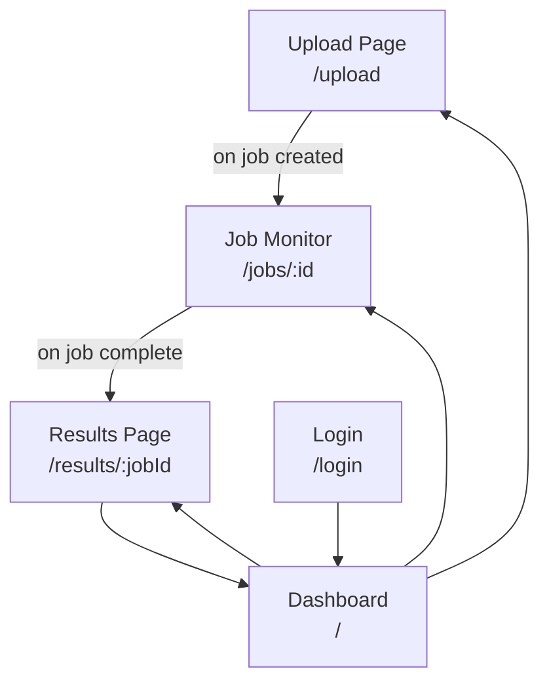

# UI/UX Document — data-cleaning-openenv

> **For AI coding tools:** Section 2 defines the required pages and flows. Section 3 defines component rules. Never add a new page or major component without a corresponding entry here. The design principles in Section 4 are non-negotiable for frontend PRs.

---

## 1. Interface Philosophy

This is a **tool for data professionals** — clarity and speed are more important than decoration. Every UI decision should answer: *"Does this help the user understand what the system is doing with their data?"*

Priority order:
1. **Correctness** — shows accurate data, correct job status, real progress.
2. **Clarity** — user always knows which step of the flow they're on.
3. **Responsiveness** — loading states on every async operation, no frozen UI.
4. **Aesthetics** — clean and professional, not distracting.

---

## 2. Pages & Flows

### 2.1 Page Map



### 2.2 Dashboard (`/`)

**Purpose:** Overview of all cleaning jobs and their statuses.

**Required elements:**
- Summary stats cards: total datasets uploaded, active jobs, completed jobs, average quality score improvement.
- Jobs table with columns: Dataset name, Status (badge), Progress bar, Created at, Actions (View / Download).
- Status badges: `QUEUED` (grey), `PROCESSING` (blue with spinner), `DONE` (green), `FAILED` (red).
- "Upload New Dataset" button → navigates to `/upload`.

**States:**
- Empty state: prompt to upload first dataset.
- Loading state: skeleton rows while fetching jobs.
- Error state: "Failed to load jobs" with a Retry button.

### 2.3 Upload Page (`/upload`)

**Purpose:** Dataset ingestion with immediate quality feedback.

**Required elements:**
- Drag-and-drop zone (accepts `.csv`, `.xlsx`, `.xls`).
- File size indicator and 100MB limit warning.
- Optional task name text input.
- Preview: first 5 rows of the dataset in a table after file selection.
- Quality score indicator (0–100%) displayed after upload.
- "Start Cleaning" button with `cleaning_mode` toggle: `conservative` / `aggressive`.
- On job creation → redirect to Job Monitor for that job.

**States:**
- Idle: drop zone prompt.
- File selected: preview table + quality score + "Start Cleaning" button.
- Uploading: progress indicator, drop zone disabled.
- Error: validation message (wrong type, too large, parse failed).

### 2.4 Job Monitor (`/jobs/:id`)

**Purpose:** Real-time visibility into a running or completed cleaning job.

**Required elements:**
- Job status badge (same colours as Dashboard).
- Progress bar: `rows_processed / total_rows`.
- Current quality score (updates as job runs).
- Agent activity breakdown: which agent took the most actions (pie or bar chart).
- Audit log preview: last 20 actions in a table (action type, row, column, old → new value, reward, agent).
- "View Full Results" button (enabled only when `status === DONE`).
- "Download Cleaned CSV" button (enabled only when `status === DONE`).

**Polling behaviour:**
- Poll `GET /api/jobs/:id` every 2 seconds while `status === PROCESSING` or `QUEUED`.
- Stop polling when `status === DONE` or `FAILED`.
- Show elapsed time counter while processing.

> [!IMPORTANT]
> **Future improvement (Phase 3 completion):** Replace polling with Server-Sent Events (SSE) from `GET /api/jobs/:id/stream`. The frontend should be designed to swap polling for SSE with minimal refactoring — abstract the update mechanism behind a `useJobProgress` hook.

**States:**
- Queued: "Waiting in queue..." message.
- Processing: live progress bar + agent activity.
- Done: full results summary + download buttons.
- Failed: error message from job metadata + "Back to Dashboard" button.

### 2.5 Results Page (`/results/:jobId`)

**Purpose:** Full audit trail and quality improvement summary for a completed job.

**Required elements:**
- Before / After quality score comparison (two large numbers or a delta).
- Issue breakdown: how many missing values filled, duplicates removed, outliers capped, types fixed.
- Full paginated audit log table: all rows, sortable by reward or action type.
- "Download Cleaned CSV" button.
- "Back to Dashboard" button.

---

## 3. Component Rules

### 3.1 File Structure

```
frontend/src/
├── pages/          ← One file per route (Dashboard.tsx, Upload.tsx, JobMonitor.tsx, Results.tsx)
├── components/
│   ├── common/     ← Shared: StatusBadge, LoadingSkeleton, ErrorBanner, EmptyState
│   ├── jobs/       ← JobTable, JobProgressBar, AgentActivityChart
│   ├── datasets/   ← UploadDropzone, DataPreviewTable, QualityScoreCard
│   └── results/    ← AuditLogTable, BeforeAfterScore, IssueBreakdownCard
├── hooks/
│   ├── useJobProgress.ts   ← Polling / SSE abstraction for live job status
│   ├── useDatasets.ts      ← Dataset list + upload logic
│   └── useAuth.ts          ← Auth state, login/logout
├── services/
│   └── api.ts      ← All Axios calls, typed request/response interfaces
└── types/
    └── index.ts    ← Shared TypeScript interfaces (Dataset, CleaningJob, AuditLog, etc.)
```

### 3.2 TypeScript Rules

- **No `any` types** — use `unknown` and narrow explicitly if needed.
- **All props must be typed** — define a `Props` interface for every component.
- **No inline API calls in components** — use `services/api.ts` functions only.
- **No business logic in pages** — pages compose components and call hooks; all state logic is in hooks.
- **`useEffect` cleanup** — every `useEffect` with a subscription, timer, or fetch must return a cleanup function.

### 3.3 Loading & Error States

Every component that fetches data must handle three states:

```tsx
// ✅ Required pattern
if (isLoading) return <LoadingSkeleton />;
if (error) return <ErrorBanner message={error.message} onRetry={refetch} />;
return <ActualContent data={data} />;
```

Never render partial data without a loading state. Never let an error go undisplayed.

### 3.4 API Client Rules (`services/api.ts`)

- All functions must return typed promises: `Promise<DatasetResponse>`, not `Promise<any>`.
- Axios errors must be caught and re-thrown as typed `ApiError` objects.
- The base URL comes from `import.meta.env.VITE_API_BASE_URL` — never hardcode `http://localhost:8000`.
- Auth token injection must be done via a single Axios request interceptor, not per-call.

---

## 4. Design Principles

### 4.1 Colours & Status

Use Material UI's semantic colours for status states — do not invent custom colours:

| Status | MUI Colour | Meaning |
|---|---|---|
| `QUEUED` | `default` (grey) | Waiting to be picked up |
| `PROCESSING` | `primary` (blue) | Actively running |
| `DONE` | `success` (green) | Completed successfully |
| `FAILED` | `error` (red) | Failed — user action needed |

### 4.2 Typography

- Page titles: MUI `variant="h4"`.
- Section headers: MUI `variant="h6"`.
- Metric numbers (quality score, row counts): MUI `variant="h3"` with `fontWeight="bold"`.
- Body text: MUI default.
- No custom CSS font sizes — use the MUI typography scale.

### 4.3 Spacing

Use MUI `sx` prop with the spacing scale (`sx={{ mt: 2, p: 3 }}`). No `style={{ marginTop: "16px" }}` inline styles for layout spacing.

---

## 5. Explicit Non-Goals for UI

- No mobile-first responsive design (desktop-first, minimum 1024px viewport assumed).
- No dark mode toggle (follows OS preference via MUI `prefers-color-scheme` only).
- No real-time collaborative editing of datasets.
- No complex data visualisation beyond bar/pie charts for agent activity and simple tables for audit logs.
- No drag-and-drop reordering of rows in audit logs.
